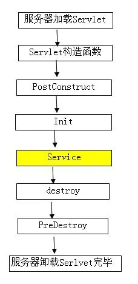

# @PostConstruct

最近在公司项目中碰到了@PostConstruct这个注解，不解其意，查阅了下，总结如下：

1、从Java EE5规范开始，Servlet中增加了两个影响Servlet生命周期的注解，@PostConstruct和@PreDestroy，这两个注解被用来修饰一个非静态的void（）方法。写法有如下两种方式：

```java
@PostConstruct

public void someMethod(){}
```

或者

```java
public @PostConstruct void someMethod(){}
```

* 被@PostConstruct修饰的方法会在服务器加载Servlet的时候运行，并且只会被服务器执行一次。PostConstruct在构造函数之后执行，init（）方法之前执行。PreDestroy（）方法在destroy（）方法知性之后执行



## spring中Constructor、@Autowired、@PostConstruct的顺序

* 其实从依赖注入的字面意思就可以知道，要将对象p注入到对象a，那么首先就必须得生成对象a和对象p，才能执行注入。所以，如果一个类A中有个成员变量p被@Autowried注解，那么@Autowired注入是发生在A的构造方法执行完之后的。

* 如果想在生成对象时完成某些初始化操作，而偏偏这些初始化操作又依赖于依赖注入，那么久无法在构造函数中实现。为此，可以使用@PostConstruct注解一个方法来完成初始化，@PostConstruct注解的方法将会在依赖注入完成后被自动调用

* Constructor >> @Autowired >> @PostConstruct

举个栗子：
```java
public Class AAA {

    @Autowired

    private BBB b;

    public AAA() {

        System.out.println("此时b还未被注入: b = " + b);

    }

    @PostConstruct

    private void init() {

        System.out.println("@PostConstruct将在依赖注入完成后被自动调用: b = " + b);

    }

}
```

