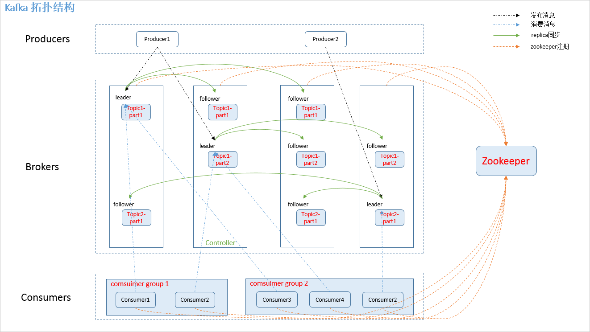
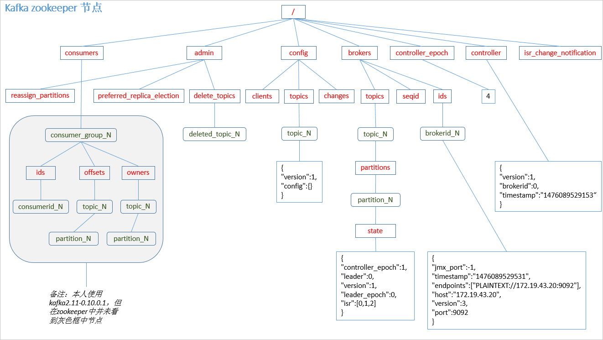
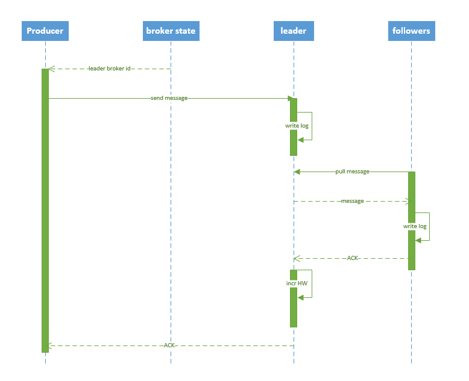

# Kafka基本架构及原理

## 一、为什么需要消息系统

> 1. 解耦：
　　允许你独立的扩展或修改两边的处理过程，只要确保它们遵守同样的接口约束。
> 2. 冗余：
　　消息队列把数据进行持久化直到它们已经被完全处理，通过这一方式规避了数据丢失风险。许多消息队列所采用的"插入-获取-删除"范式中，在把一个消息从队列中删除之前，需要你的处理系统明确的指出该消息已经被处理完毕，从而确保你的数据被安全的保存直到你使用完毕。
> 3. 扩展性：
　　因为消息队列解耦了你的处理过程，所以增大消息入队和处理的频率是很容易的，只要另外增加处理过程即可。
> 4. 灵活性 & 峰值处理能力：
　　在访问量剧增的情况下，应用仍然需要继续发挥作用，但是这样的突发流量并不常见。如果为以能处理这类峰值访问为标准来投入资源随时待命无疑是巨大的浪费。使用消息队列能够使关键组件顶住突发的访问压力，而不会因为突发的超负荷的请求而完全崩溃。
> 5. 可恢复性：
　　系统的一部分组件失效时，不会影响到整个系统。消息队列降低了进程间的耦合度，所以即使一个处理消息的进程挂掉，加入队列中的消息仍然可以在系统恢复后被处理。
> 6. 顺序保证：
　　在大多使用场景下，数据处理的顺序都很重要。大部分消息队列本来就是排序的，并且能保证数据会按照特定的顺序来处理。（Kafka 保证一个 Partition 内的消息的有序性）
> 7. 缓冲：
　　有助于控制和优化数据流经过系统的速度，解决生产消息和消费消息的处理速度不一致的情况。
> 8. 异步通信：
　　很多时候，用户不想也不需要立即处理消息。消息队列提供了异步处理机制，允许用户把一个消息放入队列，但并不立即处理它。想向队列中放入多少消息就放多少，然后在需要的时候再去处理它们。

## 二、kafka 架构

### 2.1 拓扑结构

如下图：


### 2.2 相关概念

如图.1中，kafka 相关名词解释如下

> 1. producer：
　　消息生产者，发布消息到 kafka 集群的终端或服务。
> 2. broker：
　　kafka 集群中包含的服务器。
> 3. topic：
　　每条发布到 kafka 集群的消息属于的类别，即 kafka 是面向 topic 的。
> 4. partition：
　　partition 是物理上的概念，每个 topic 包含一个或多个 partition。kafka 分配的单位是 partition。
> 5. consumer：
　　从 kafka 集群中消费消息的终端或服务。
> 6. Consumer group：
　　high-level consumer API 中，每个 consumer 都属于一个 consumer group，每条消息只能被 consumer group 中的一个 Consumer 消费，但可以被多个 consumer group 消费。
> 7. replica：
　　partition 的副本，保障 partition 的高可用。
> 8. leader：
　　replica 中的一个角色， producer 和 consumer 只跟 leader 交互。
> 9. follower：
　　replica 中的一个角色，从 leader 中复制数据。
> 10. controller：
　　kafka 集群中的其中一个服务器，用来进行 leader election 以及 各种 failover。
> 11. zookeeper：
　　kafka 通过 zookeeper 来存储集群的 meta 信息。

### 2.3 zookeeper 节点

kafka在zookeeper中的存储结构图:



## 三、producer 发布消息

### 3.1 写入方式

producer 采用 push 模式将消息发布到 broker，每条消息都被 append 到 patition 中，属于顺序写磁盘（顺序写磁盘效率比随机写内存要高，保障 kafka 吞吐率）。

### 3.2 消息路由

producer 发送消息到 broker 时，会根据分区算法选择将其存储到哪一个 partition。其路由机制为：

> 1. 指定了 patition，则直接使用；
> 2. 未指定 patition 但指定 key，通过对 key 的 value 进行hash 选出一个 patition
> 3. patition 和 key 都未指定，使用轮询选出一个 patition。

附上 java 客户端分区源码，一目了然：
```java
//创建消息实例
public ProducerRecord(String topic, Integer partition, Long timestamp, K key, V value) {
     if (topic == null)
          throw new IllegalArgumentException("Topic cannot be null");
     if (timestamp != null && timestamp < 0)
          throw new IllegalArgumentException("Invalid timestamp " + timestamp);
     this.topic = topic;
     this.partition = partition;
     this.key = key;
     this.value = value;
     this.timestamp = timestamp;
}

//计算 patition，如果指定了 patition 则直接使用，否则使用 key 计算
private int partition(ProducerRecord<K, V> record, byte[] serializedKey , byte[] serializedValue, Cluster cluster) {
     Integer partition = record.partition();
     if (partition != null) {
          List<PartitionInfo> partitions = cluster.partitionsForTopic(record.topic());
          int lastPartition = partitions.size() - 1;
          if (partition < 0 || partition > lastPartition) {
               throw new IllegalArgumentException(String.format("Invalid partition given with record: %d is not in the range [0...%d].", partition, lastPartition));
          }
          return partition;
     }
     return this.partitioner.partition(record.topic(), record.key(), serializedKey, record.value(), serializedValue, cluster);
}

// 使用 key 选取 patition
public int partition(String topic, Object key, byte[] keyBytes, Object value, byte[] valueBytes, Cluster cluster) {
     List<PartitionInfo> partitions = cluster.partitionsForTopic(topic);
     int numPartitions = partitions.size();
     if (keyBytes == null) {
          int nextValue = counter.getAndIncrement();
          List<PartitionInfo> availablePartitions = cluster.availablePartitionsForTopic(topic);
          if (availablePartitions.size() > 0) {
               int part = DefaultPartitioner.toPositive(nextValue) % availablePartitions.size();
               return availablePartitions.get(part).partition();
          } else {
               return DefaultPartitioner.toPositive(nextValue) % numPartitions;
          }
     } else {
          //对 keyBytes 进行 hash 选出一个 patition
          return DefaultPartitioner.toPositive(Utils.murmur2(keyBytes)) % numPartitions;
     }
}
```

### 3.3 写入流程

producer 写入消息序列图如下所示：



流程说明：

> 1. producer 先从 zookeeper 的 "/brokers/.../state" 节点找到该 partition 的 leader
> 2. producer 将消息发送给该 leader
> 3. leader 将消息写入本地 log
> 4. followers 从 leader pull 消息，写入本地 log 后 leader 发送 ACK
> 5. leader 收到所有 ISR 中的 replica 的 ACK 后，增加 HW（high watermark，最后 commit 的 offset） 并向 producer 发送 ACK

### 3.4 producer delivery guarantee

 一般情况下存在三种情况：

> 1. At most once 消息可能会丢，但绝不会重复传输
> 2. At least one 消息绝不会丢，但可能会重复传输
> 3. Exactly once 每条消息肯定会被传输一次且仅传输一次

当 producer 向 broker 发送消息时，一旦这条消息被 commit，由于 replication 的存在，它就不会丢。但是如果 producer 发送数据给 broker 后，遇到网络问题而造成通信中断，那 Producer 就无法判断该条消息是否已经 commit。虽然 Kafka 无法确定网络故障期间发生了什么，但是 producer 可以生成一种类似于主键的东西，发生故障时幂等性的重试多次，这样就做到了 Exactly once，但目前还并未实现。所以目前默认情况下一条消息从 producer 到 broker 是确保了 At least once，可通过设置 producer 异步发送实现At most once。

## 四、broker 保存消息

### 4.1 存储方式

物理上把 topic 分成一个或多个 patition（对应 server.properties 中的 num.partitions=3 配置），每个 patition 物理上对应一个文件夹（该文件夹存储该 patition 的所有消息和索引文件），如下：

